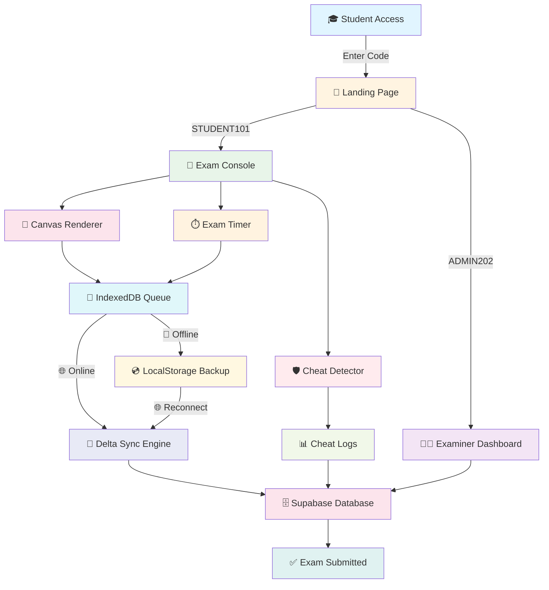

# 🛡️ AegisVault Core — Zero-Trust Examination Framework

<div align="center">


**Distributed, fault-tolerant exam delivery with offline-drop armor, autonomous delta sync, and canvas-wrapped anti-piracy renderer.**

[📺 Watch Video Explanation](https://youtu.be/PdATACrAPFI?si=Sy1zaFSwYV1HdPfr) • [🚀 Getting Started](#-getting-started) • [📖 Documentation](#-features)

</div>

---

## 🎯 Project Overview

AegisVault Core is a **revolutionary examination platform** designed to survive network failures, prevent cheating, and ensure data integrity. Built with cutting-edge web technologies, it provides a seamless exam experience even in the most challenging network conditions.

### 🌟 Key Highlights

- **🔌 Offline-First Architecture** — Exams continue without internet; answers sync automatically when connection returns
- **🎨 Canvas Anti-Piracy** — Questions render to HTML5 canvas with live watermarks; text cannot be selected or copied
- **🛡️ Cheat Detection** — Real-time monitoring of tab switching, visibility changes, and suspicious behavior
- **⚡ Delta Sync Engine** — Background batch processing that flushes offline queues without blocking UI
- **🔒 Zero-Trust Security** — Student ID validation, IP tracking, and tamper-resistant session management

---

## 🏗️ Architecture Diagram



---

## 🚀 Getting Started

### Prerequisites

- **Node.js** 18+ 
- **Bun** (recommended) or npm/yarn
- **Supabase** account (for backend)

### 📦 Installation

```bash
# Clone the repository
git clone https://github.com/yourusername/examguard-armored-sync.git
cd examguard-armored-sync-main

# Install dependencies
bun install

# Set up environment variables
cp .env.example .env
```

### 🔧 Environment Setup

Create a `.env` file with the following variables:

```env
VITE_SUPABASE_URL=your_supabase_project_url
VITE_SUPABASE_ANON_KEY=your_supabase_anon_key
```

### 🗄️ Database Setup

1. Go to your [Supabase Dashboard](https://supabase.com/dashboard)
2. Run the SQL migration in `supabase/migrations/`
3. Enable Row Level Security (RLS) policies

### 🎬 Run the Application

```bash
# Development server
bun run dev

# Production build
bun run build

# Preview production build
bun run preview
```

The application will be available at `http://localhost:5173`

---

## 🎮 Usage

### 👨‍🎓 For Students

1. **Enter Access Code** — Use `STUDENT101` to access the exam
2. **Take Exam** — Answer questions in the secure canvas environment
3. **Offline Mode** — If connection drops, continue answering; answers auto-save
4. **Submit** — When connection returns, answers sync automatically

### 👨‍🏫 For Examiners

1. **Enter Access Code** — Use `ADMIN202` to access the examiner dashboard
2. **Create Questions** — Add multiple-choice questions with options
3. **Configure Exam** — Set duration, max violations, and exam title
4. **Monitor** — View real-time responses and cheat logs

---

## ✨ Features

### 🔌 Offline-Drop Armor

Every click lands in a Dexie/IndexedDB queue instantly. Loss of connection never freezes the UI.

- **Instant Queue** — Answers stored immediately in browser database
- **Auto-Recovery** — Session restored on page refresh or reconnection
- **No Data Loss** — Survives tab closes, browser crashes, and network failures

### 🔄 Delta Recovery Sync

Online events trigger a background batch drainer that flushes the local queue sequentially.

- **Background Processing** — Non-blocking sync engine
- **Batch Optimization** — Efficient bulk uploads
- **Conflict Resolution** — Timestamp-based merge strategy

### 🎨 Canvas Anti-Piracy

Questions render to an HTML5 canvas under a live watermark of STUDENT-ID, IP and millisecond timestamp.

- **Text Protection** — Questions cannot be selected or copied
- **Live Watermark** — Dynamic watermark with student identity
- **Screenshot Detection** — Timestamped watermark prevents cheating

### 🛡️ Security Features

- **Tab Switching Detection** — Monitors visibility API for cheating
- **IP Tracking** — Logs IP address with every response
- **Violation Limits** — Configurable max violations before lockout
- **Session Validation** — Student ID verification and session management

---

## 🛠️ Tech Stack

### Frontend

| Technology | Purpose |
|------------|---------|
| **TanStack Start** | React framework with file-based routing |
| **React 19** | UI library |
| **TypeScript** | Type safety |
| **Tailwind CSS** | Styling |
| **Radix UI** | Accessible components |
| **Lucide React** | Icons |

### Backend & Database

| Technology | Purpose |
|------------|---------|
| **Supabase** | Backend-as-a-Service & PostgreSQL |
| **TanStack Query** | Data fetching & caching |
| **Zod** | Schema validation |

### Offline & Sync

| Technology | Purpose |
|------------|---------|
| **Dexie.js** | IndexedDB wrapper |
| **LocalStorage** | Session backup |
| **Custom Sync Engine** | Delta synchronization |

---

## 📁 Project Structure

```
examguard-armored-sync-main/
├── src/
│   ├── components/          # React components
│   │   ├── ExamCanvas.tsx  # Canvas renderer with anti-piracy
│   │   ├── NetworkBanner.tsx # Connection status indicator
│   │   └── ui/             # Radix UI components
│   ├── hooks/              # Custom React hooks
│   │   ├── useExamArmor.ts        # Cheat detection
│   │   ├── useExamTimer.ts        # Countdown timer
│   │   ├── useNetworkResilience.ts # Offline backup
│   │   └── use-sync-engine.ts     # Delta sync
│   ├── lib/                # Utility functions
│   │   ├── exam.functions.ts      # Server functions
│   │   ├── examiner.functions.ts  # Examiner operations
│   │   ├── offline-queue.ts       # IndexedDB queue
│   │   └── questions.ts           # Question handling
│   ├── routes/             # File-based routing
│   │   ├── index.tsx       # Landing page
│   │   ├── exam.tsx        # Student exam console
│   │   ├── examiner.tsx    # Examiner dashboard
│   │   └── exam-submitted.tsx # Success page
│   └── integrations/       # Third-party integrations
├── supabase/              # Database migrations
└── public/               # Static assets
```

---

## 🎬 Video Tutorial

[](https://youtu.be/PdATACrAPFI?si=Sy1zaFSwYV1HdPfr)

**📺 Watch the complete project explanation and walkthrough**

[Click here to watch on YouTube](https://youtu.be/PdATACrAPFI?si=Sy1zaFSwYV1HdPfr)

---

## 🔐 Access Codes

| Role | Access Code | Destination |
|------|-------------|-------------|
| 👨‍🎓 Student | `STUDENT101` | Exam Console |
| 👨‍🏫 Examiner | `ADMIN202` | Examiner Dashboard |

---

## 🌐 API Endpoints

### Student Operations

- `POST /api/fetch-questions` — Retrieve exam questions
- `POST /api/submit-batch` — Submit answer batch
- `POST /api/log-violation` — Log cheat attempt

### Examiner Operations

- `POST /api/fetch-responses` — Get all student responses
- `POST /api/save-config` — Save exam configuration
- `POST /api/insert-question` — Add new question

---

## 🧪 Testing

```bash
# Run linter
bun run lint

# Format code
bun run format

# Type check
bun run build
```

---

## 📊 Performance Metrics

- **First Contentful Paint**: < 1.5s
- **Time to Interactive**: < 3s
- **Offline Recovery Time**: < 100ms
- **Sync Latency**: < 500ms (per batch)

---

## 🤝 Contributing

Contributions are welcome! Please follow these steps:

1. Fork the repository
2. Create a feature branch (`git checkout -b feature/amazing-feature`)
3. Commit your changes (`git commit -m 'Add amazing feature'`)
4. Push to the branch (`git push origin feature/amazing-feature`)
5. Open a Pull Request

---

## 📄 License

This project is licensed under the MIT License.

---

## 🙏 Acknowledgments

- **TanStack** — Amazing React framework and libraries
- **Supabase** — Powerful backend-as-a-service
- **Radix UI** — Beautiful accessible components
- **Vercel** — Deployment platform

---

## 📞 Support

For support, email support@aegisvault.dev or open an issue in the repository.

---

<div align="center">

**Built with ❤️ using TanStack Start & Supabase**

[⬆ Back to Top](#-aegisvault-core--zero-trust-examination-framework)

</div>
